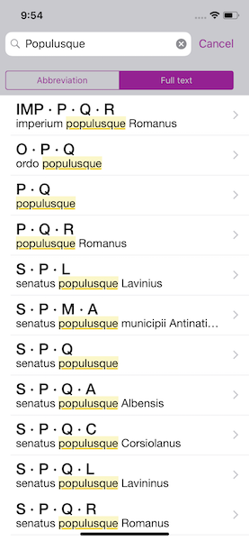

#  Inscriptus iOS

Romans had a lot of abbreviations they used when inscribing text. This app lets you search through many of these common abbreviations and see what they stand for. You can favorite abbreviations that you want to refer to again, and view the definition of words (thanks to Whitaker's Words, a well-known Latin dictionary and parser).

This was developed in conjunction with a professor at the University of Rochester Department of Classics in 2015.

[It's also available for free on the App Store.](https://itunes.apple.com/us/app/inscriptus/id995710706?ls=1&mt=8)

